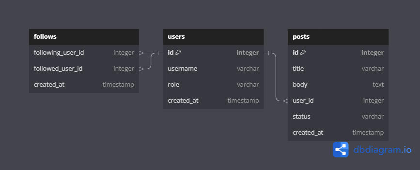
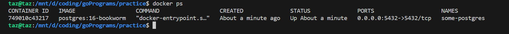

Backend System Development

## Database Schema Generation (Postrgesql)

Before starting development, we need to create a database schema. We can take help of tools like [dbdiagram.io](https://dbdiagram.io/home) to create a database schema.



This is a simple database schema for a blog application. We have 2 tables, `users` and `posts`. A user can have multiple posts, but a post can only have one user. This is a one-to-many relationship.

Users can follow other users. This is a many-to-many relationship. We need a third table to store this relationship. We call this table `follows`. This table has two columns, `following_user_id` and `following_user_id`. Both of these columns are foreign keys to the `users` table.

Once created you can export the schema as a SQL file. This file can be used to create the database schema in Postgresql (or any other database).

## Getting a Postgresql Database (Docker)

We will use Docker to run Postgresql. You can install Docker from [here](https://docs.docker.com/get-docker/).

Once installed, you can run the following command to start a Postgresql database.

```bash
docker run --name some-postgres -p 5432:5432 -e POSTGRES_USER=root -e POSTGRES_PASSWORD=password -d postgres:16-bookworm
```

What does this command do?

- `docker run`: This command is used to run a docker container.
- `--name some-postgres`: This is the name of the container. You can use any name you want.
- `-p 5432:5432`: This is used to map the port 5432 of the container to the port 5432 of the host machine. Postgresql runs on port 5432 by default.
- `-e` is used to set environment variables. We are setting the username and password for the database.
- `-d` is used to run the container in the background.
- `postgres:16-bookworm` is the name of the image we want to run. This is the image for Postgresql version 16-bookworm.

After running this command, you can check if the container is running by running the following command.

```bash
docker ps
```



You can connect to the database using the following command.

```bash
docker exec -it some-postgres psql -U root
```

This will open the Postgresql shell inside the container.

Note: You can use docker logs < container-id > to see the logs of the container.

